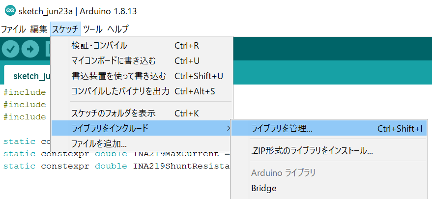
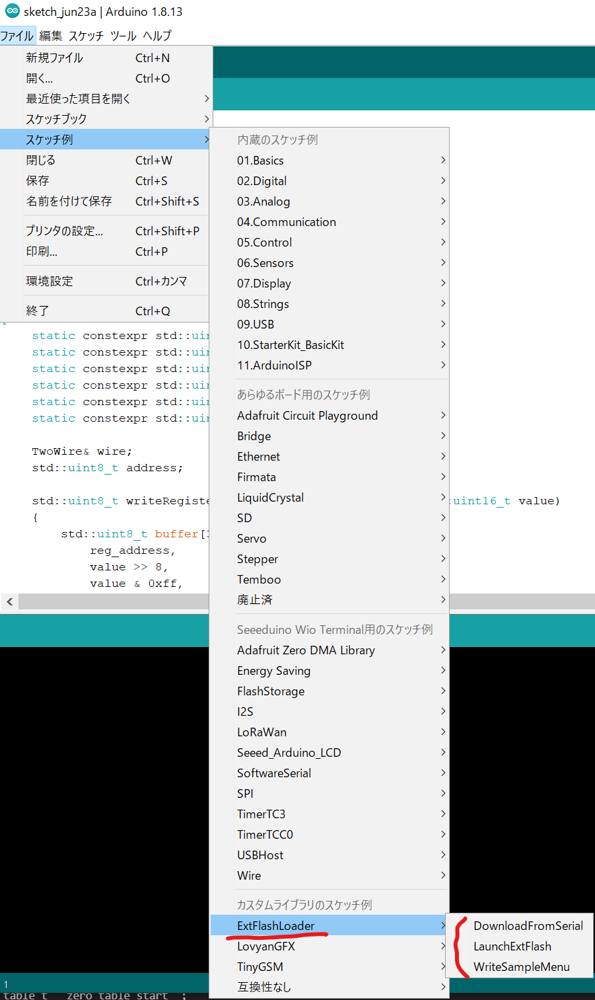

# External Flash Loader library for Wio Terminal

## What Is This?

This is an Arduino library to access external flash memory connected to ATSAMD51 on Wio Terminal.

And this Arduino library also contains a sample sketch to flash the menu application, which select and load applications from the TF card, by using the library function.

Applications can return to the menu app by embedding codes to launch the menu app if the button is pressed.

The `LaunchExtFlash.ino` sample sketch launches the menu app by resetting the Wio Terminal while the button A is pressed.

[](https://www.youtube.com/watch?v=lPJtOYFQees)

## How To Use

### How To Install This Library

Select `ExtFlashLoader` from the library manager of Arduino IDE and install it.




After installing the library completes, the sample sketches of `ExtFlashLoader` is added to the sketch example menu of Arduino IDE.



### Writing the menu app

The menu app must have been written to the external flash to use the menu app.

Becase the bootloader of Wio Terminal cannot write to the external flash, the user must use `WriteSampleMenu.ino` sample sketch to write the menu app to the external flash.

`WriteSampleMenu.ino` contains the binary of the menu app and it automatically writes the menu app to the external flash after launched.

If the sample sketch writes the menu app successfully, then the menu app starts.

### How to use the menu app

The menu app shows the list of applications in `/apps` directory of the TF card. 

Every application must be contained for its dedicated direcory in the `apps` directory.

```
/apps
 +- app1
    +- app.bin --- app1's binary
    +- app.png --- Image file to describe the contents of app1 (Optional)
    +- name    --- File which contains the name of app1
    +- desc    --- File which contains the description of app1 (Optional)
 +- app2
    +- app.bin --- app2's binary
    +- app.png --- Image file to describe the contents of app2 (Optional)
    +- name    --- File which contains the name of app2
    +- desc    --- File which contains the description of app2 (Optional)
  +- hoge
    +- app.bin --- hoge's binary
    +- app.png --- Image file to describe the contents of hoge (Optional)
    +- name    --- File which contains the name of hoge
    +- desc    --- File which contains the description of hoge (Optional)
  +- fuga
    +- app.bin --- fuga's binary
    +- app.png --- Image file to describe the contents of fuga (Optional)
    +- name    --- File which contains the name of fuga
    +- desc    --- File which contains the description of fuga (Optional)
```

Store application's binary as `app.bin`.

`name` is a file which contains application's name. Maximum length of the `name` file is 64 bytes.

`desc` is a file which contains application's description. Maximum length of the `desc` file is 64 bytes.

`app.png` is an image file which describes the application. Size of the area to show these image files is 160x120, thus size of the image must be less than 160x120.

If you insert the TF card that stores the application with the above structure into the Wio Terminal, a list of applications will be displayed.

Select an application with the up and down of the stick and push the stick to write the selected application to the built-in flash.

For trial purposes, the sample code of [LovyanGFX](https://github.com/lovyan03/LovyanGFX) with suporting to return to the menu app is available. [You can download it here. ] (https://github.com/ciniml/ExtFlashLoader/releases/download/0.1.0/extflashloader_sample.zip)

After downloading it, extract the ZIP file, then write the `apps` directory that appears in the root of the TF card.

### How To Implement Menu App Support

The menu app on the external flash cannot be started from the boot loader of Wio Terminal.

Therefore, it is necessary to add some codes to start the menu app at the time of startup of the main app.

In the attached sample sketch `LaunchExtFlash.ino`, if the `button A` is pressed at startup, the menu app will be launched.

```LaunchExtFlash.ino
#include <TFT_eSPI.h>
#include <cstdint>
#include <ExtFlashLoader.h>

TFT_eSPI tft;

void setup() {
    tft.begin();
    tft.setRotation(3);
    tft.fillScreen(0);

    pinMode(WIO_KEY_A, INPUT_PULLUP);
    if( digitalRead(WIO_KEY_A) == LOW) {
      tft.printf("Launching QSPI application\r\n");
      ExtFlashLoader::ExtFlashLoader loader;
    }
    
    tft.printf("Normal flash application\r\n");

    Serial.begin(115200);
    while(!Serial);
}
void loop() {

}
```

On the `13th line`, check if the input of button A (`WIO_KEY_A`) is pressed (==`LOW`).

If button A is pressed, execute `ExtFlashLoader::ExtFlashLoader loader;` and launch the menu app on the external flash.

You can create an application that supports loading from the TF card by embedding the above code into the application.

## License

The license of the main module  `ExtFlashLoader.hpp` is `Boost Software License 1.0`.
You can use the code freely as long as you keep the license code of the source code.

